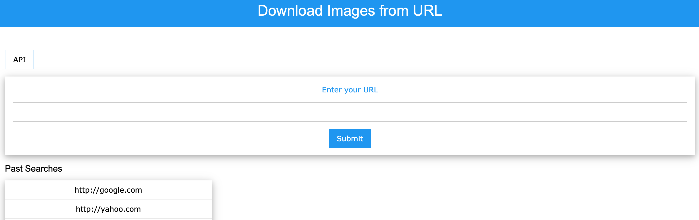

# Flask Example
The example demonstrate creating Web API with Flask & Python.

## download_images:
Presents all the jpg, jpeg and  png file from URL.

## API usage:
*Retrieve Images from URL:*
For ex: `http://127.0.0.1:5000/get_images/yahoo.com`

## Basic Usage:
`export FLASK_APP=download_images`
`flask run`

## Screenshot

